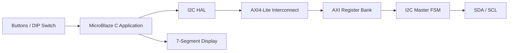
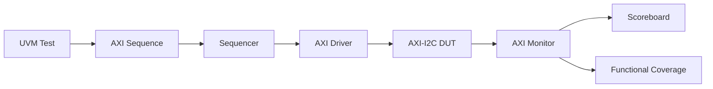

# AXI4-Lite I2C Master Controller with UVM Verification

MicroBlaze 소프트웨어에서 AXI4-Lite 레지스터를 통해 제어하는 커스텀 I2C Master IP 프로젝트입니다.

FPGA 보드의 버튼과 DIP switch를 사용하여 I2C의 `START`, `WRITE`, `READ`, `STOP` 명령을 직접 실행할 수 있습니다. SystemVerilog UVM 테스트벤치를 통해 AXI4-Lite 레지스터 인터페이스를 검증합니다.

> **Verification Scope**
>
> 현재 UVM 환경은 AXI4-Lite transaction, response, register readback 및 functional coverage를 검증합니다.  
> I2C slave model은 아직 구현되어 있지 않으므로 SDA/SCL 수준의 end-to-end I2C protocol verification은 포함하지 않습니다.

---

## Project Overview

| 항목 | 내용 |
|---|---|
| FPGA 설계 | Xilinx Vivado Block Design + Custom RTL IP |
| Processor | MicroBlaze |
| Control Interface | AXI4-Lite |
| AXI Data Width | 32-bit |
| AXI Address Width | 4-bit |
| I2C Operation | Master, START / WRITE / READ / STOP |
| I2C Clock | 약 100 kHz, 100 MHz 입력 클럭 기준 |
| Software | Vitis C Application + I2C HAL |
| Verification | SystemVerilog UVM 1.2 |
| Board Interface | Button, DIP Switch, 7-Segment Display |

---


## Demo Video

https://github.com/user-attachments/assets/f47cbe0b-bb04-46dc-99de-e34aac6554ef

```markdown
[Watch the FPGA Demo Video](https://github.com/user-attachments/assets/VIDEO_ID)
```

---

## System Architecture



MicroBlaze application은 I2C HAL을 통해 AXI4-Lite 레지스터에 명령과 송신 데이터를 기록합니다.

I2C Master FSM은 AXI 레지스터에 기록된 명령을 SDA/SCL 동작으로 변환하고, 수신 데이터와 상태를 AXI 레지스터를 통해 소프트웨어에 제공합니다.

---

## Hardware Block Diagram

<p align="center">
  
</p>

<p align="center">
  <em>Vivado Block Design of the AXI4-Lite I2C Master System</em>
</p>

---

## Features

- AXI4-Lite slave 기반 I2C Master 제어
- I2C START condition 생성
- 8-bit WRITE transaction
- 8-bit READ transaction
- I2C STOP condition 생성
- Slave ACK/NACK 수신
- Master ACK/NACK 전송
- SDA open-drain 출력
- 외부 pull-up 기반 SDA High 상태
- 100 MHz 입력 클럭 기준 100 kHz I2C clock 생성
- MicroBlaze용 C HAL 제공
- Button 및 DIP switch 기반 수동 제어
- 수신 데이터를 7-segment display로 출력
- UVM sequence, driver, monitor, scoreboard 제공
- AXI register functional coverage 제공

---

## AXI4-Lite Register Map

현재 C HAL에 설정된 I2C IP base address는 다음과 같습니다.

```text
0x44A0_0000
```

Vivado Block Design에서 IP address가 변경되면 C HAL의 base address도 함께 변경해야 합니다.

| Offset | Register | Access | Bit | Description |
|---:|---|:---:|---:|---|
| `0x00` | CONTROL | R/W | 0 | `START` command |
|  |  |  | 1 | `WRITE` command |
|  |  |  | 2 | `READ` command |
|  |  |  | 3 | `STOP` command |
|  |  |  | 4 | Master response after READ: `0=ACK`, `1=NACK` |
| `0x04` | TX_DATA | R/W | `[7:0]` | Transmit data |
| `0x08` | STATUS | R | 0 | `done` |
|  |  |  | 1 | `busy` |
|  |  |  | 2 | Slave response: `0=ACK`, `1=NACK` |
| `0x0C` | RX_DATA | R | `[7:0]` | Received data |

### CONTROL Register

```text
Bit 4     Bit 3     Bit 2     Bit 1      Bit 0
ACK_IN    STOP      READ      WRITE      START
```

CONTROL command는 HAL에서 해당 bit를 `1`로 설정한 다음 다시 `0`으로 내리는 pulse 방식으로 전달합니다.

### STATUS Register

```text
Bit 2       Bit 1      Bit 0
ACK_OUT     BUSY       DONE
```

WRITE 및 READ 함수는 `STATUS.done`을 polling하여 byte transaction 완료를 기다립니다.

---

## I2C Master Operation

RTL의 핵심 FSM 흐름은 다음과 같습니다.

```text
IDLE
  |
  v
START
  |
  v
WAIT_CMD
  |
  +------> DATA ------> DATA_ACK ------+
  |                                    |
  +------------------------------------+
  |
  v
STOP
  |
  v
IDLE
```

### START

SCL이 High인 상태에서 SDA를 High에서 Low로 전환하여 START condition을 생성합니다.

### WRITE

1. 송신 데이터를 `TX_DATA` 레지스터에 기록합니다.
2. CONTROL 레지스터의 WRITE bit에 pulse를 발생시킵니다.
3. I2C Master가 MSB부터 8-bit를 전송합니다.
4. 9번째 clock에서 slave의 ACK/NACK를 수신합니다.
5. 수신된 응답은 `STATUS.ack_out`에 저장됩니다.

### READ

1. CONTROL 레지스터의 ACK/NACK 값을 설정합니다.
2. READ bit에 pulse를 발생시킵니다.
3. Slave가 SDA에 출력한 8-bit 데이터를 수신합니다.
4. 9번째 clock에서 Master가 ACK 또는 NACK를 전송합니다.
5. 수신 데이터는 `RX_DATA` 레지스터에 저장됩니다.

### STOP

SCL이 High인 상태에서 SDA를 Low에서 High로 전환하여 STOP condition을 생성합니다.

### SDA Open-Drain

SDA 출력은 다음 방식으로 동작합니다.

```systemverilog
assign sda = sda_o ? 1'bz : 1'b0;
```

- Logic `0`: SDA를 Low로 직접 구동
- Logic `1`: SDA를 High-Z로 해제
- SDA High 상태: 외부 pull-up resistor에 의해 생성

---

## MicroBlaze Software

### I2C HAL API

```c
void I2C_init(
    I2C_handler_t *hi2c,
    uint32_t instance
);

void I2C_Start(
    I2C_handler_t *hi2c
);

uint8_t I2C_Write(
    I2C_handler_t *hi2c,
    uint8_t data
);

uint8_t I2C_Read(
    I2C_handler_t *hi2c,
    uint8_t ack
);

void I2C_Stop(
    I2C_handler_t *hi2c
);
```

### Example Transaction

```c
I2C_Start(&hi2c);

I2C_Write(&hi2c, slave_address << 1);
I2C_Write(&hi2c, register_address);
I2C_Write(&hi2c, write_data);

I2C_Stop(&hi2c);
```

### Board Input Mapping

| Input | Function |
|---|---|
| Button D4 | I2C START |
| Button D5 | I2C WRITE |
| Button D6 | I2C READ |
| Button D7 | I2C STOP |
| DIP Switch A0-A7 | 8-bit transmit data |

WRITE 명령을 실행하면 DIP switch의 현재 값이 I2C bus로 전송됩니다.

READ 명령을 실행하면 수신한 byte가 7-segment display에 표시됩니다.

---

## UVM Verification Environment



### UVM Components

| Component | Description |
|---|---|
| `axi_i2c_seq_item` | AXI transaction 정의 |
| `axi_i2c_seq` | Directed 및 constrained-random transaction 생성 |
| `axi_i2c_sequencer` | Sequence item 전달 |
| `axi_i2c_driver` | AXI AW/W/B 및 AR/R channel 구동 |
| `axi_i2c_monitor` | AXI transaction 관찰 |
| `axi_i2c_scoreboard` | AXI response 및 register readback 비교 |
| `axi_i2c_coverage` | Address/access functional coverage 수집 |
| `axi_i2c_agent` | Driver, sequencer, monitor 구성 |
| `axi_i2c_env` | Agent, scoreboard, coverage 연결 |
| `axi_i2c_test` | Test sequence 실행 |

### Test Sequence

현재 sequence는 다음 transaction을 수행합니다.

1. CONTROL register deterministic write/read
2. TX_DATA register deterministic write/read
3. 1,000개의 constrained-random AXI transaction

Random transaction의 주소 범위는 다음과 같습니다.

```text
0x00 : CONTROL
0x04 : TX_DATA
0x08 : STATUS
0x0C : RX_DATA
```

Write transaction은 CONTROL과 TX_DATA 레지스터로 제한됩니다.

### Scoreboard Checks

Scoreboard는 다음 항목을 확인합니다.

- AXI write response가 `OKAY`인지 확인
- AXI read response가 `OKAY`인지 확인
- CONTROL register reference model 관리
- TX_DATA register reference model 관리
- Write strobe를 반영한 register update
- CONTROL/TX_DATA readback 비교
- 전체 transaction 수 집계
- PASS/FAIL transaction 수 집계

### Functional Coverage

다음 coverpoint와 cross coverage를 수집합니다.

- Register address coverage
- Read/write access coverage
- Address × access type cross coverage

동적 레지스터인 STATUS와 RX_DATA에 대한 write combination은 coverage에서 제외됩니다.

---

## Verification Scope and Limitations

| Verification Item | Status | Description |
|---|:---:|---|
| AXI write handshake | Implemented | AW/W/B channel 처리 |
| AXI read handshake | Implemented | AR/R channel 처리 |
| AXI response check | Implemented | `OKAY` response 확인 |
| CONTROL readback | Implemented | Reference model과 비교 |
| TX_DATA readback | Implemented | Reference model과 비교 |
| STATUS verification | Partial | AXI response만 확인 |
| RX_DATA verification | Partial | AXI response만 확인 |
| Address coverage | Implemented | 4개 register address 확인 |
| Read/write coverage | Implemented | Access type 확인 |
| I2C slave model | Not implemented | SDA data 및 ACK 생성 모델 없음 |
| I2C protocol monitor | Not implemented | START/STOP/ACK 의미 검증 없음 |
| I2C timing checker | Not implemented | Setup/hold 및 SCL timing 검증 없음 |
| Clock stretching | Not implemented | RTL 및 testbench 미지원 |
| Multi-master arbitration | Not implemented | Single-master 구조 |

현재 UVM 결과는 **AXI4-Lite register interface verification 결과**입니다.

실제 I2C slave와의 통신까지 검증하려면 I2C slave BFM, serial monitor 및 end-to-end scoreboard가 추가로 필요합니다.

---

## Repository Structure

```text
.
├── IP_RTL/
│   ├── AXI_I2C_P_v1_0.v
│   └── AXI_I2C_P_v1_0_S00_AXI.v
│
├── UVM/
│   ├── component/
│   │   ├── tb_top.sv
│   │   ├── i2c_axi_if.sv
│   │   ├── axi_i2c_seq_item.sv
│   │   ├── axi_i2c_seq.sv
│   │   ├── axi_i2c_sequencer.sv
│   │   ├── axi_i2c_driver.sv
│   │   ├── axi_i2c_monitor.sv
│   │   ├── axi_i2c_agent.sv
│   │   ├── axi_i2c_scoreboard.sv
│   │   ├── axi_i2c_coverage.sv
│   │   ├── axi_i2c_env.sv
│   │   └── axi_i2c_test.sv
│   ├── Makefile
│   └── filelist.f
│
├── vitis_workspace/
│   └── AXI_I2C_p/
│       └── src/
│           ├── HAL/I2C/
│           │   ├── I2C.h
│           │   └── I2C.c
│           └── ap/
│               └── ap_main.c
│
└── 2026_Project_AXI_I2C.srcs/
    └── Vivado Block Design, Constraints and IP Sources
```

---

## UVM Simulation

Synopsys VCS와 UVM 1.2가 설정된 환경에서 repository root를 기준으로 실행합니다.

### Compile

```bash
vcs -full64 -sverilog -ntb_opts uvm-1.2 \
  -timescale=1ns/1ps \
  +incdir+UVM/component \
  IP_RTL/AXI_I2C_P_v1_0_S00_AXI.v \
  IP_RTL/AXI_I2C_P_v1_0.v \
  UVM/component/tb_top.sv \
  -top tb_top \
  -o simv
```

### Run

```bash
./simv \
  +UVM_TESTNAME=axi_i2c_test \
  +ntb_random_seed=1234
```

> 현재 `UVM/Makefile`과 `UVM/filelist.f`에는 이전 디렉터리 구조를 기준으로 작성된 경로가 포함되어 있습니다. 현재 source tree에서는 위의 root-relative 명령을 기준으로 사용하십시오.

---

## Vivado and Vitis Workflow

1. `IP_RTL/`의 custom AXI-I2C RTL을 Vivado project에 추가합니다.
2. `2026_Project_AXI_I2C.srcs/`의 Block Design과 constraint를 구성합니다.
3. Block Design validation을 수행합니다.
4. HDL wrapper와 bitstream을 생성합니다.
5. Hardware platform을 Vitis로 export합니다.
6. `vitis_workspace/AXI_I2C_p/src/`의 application과 HAL을 build합니다.
7. FPGA를 program합니다.
8. MicroBlaze application을 실행합니다.
9. Button과 DIP switch로 I2C command를 입력합니다.
10. UART log와 7-segment display로 결과를 확인합니다.

---
