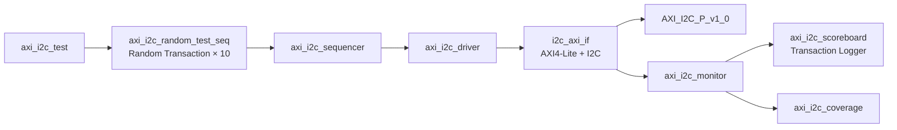
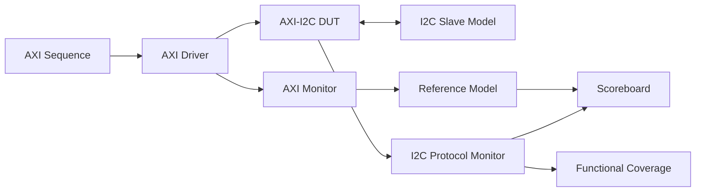

# AXI4-Lite I2C UVM Verification Environment

AXI4-Lite로 제어되는 I2C Master IP의 Register 접근 동작을 검증하기 위해 구성한  
**SystemVerilog UVM 기반 검증 환경**입니다.

현재 검증 환경은 AXI4-Lite Read/Write Transaction 생성, 신호 수집 및  
Register Address·Access Type Functional Coverage 수집을 지원합니다.

> 현재 Scoreboard는 Transaction 출력 기능만 구현된 초기 구조입니다.  
> Register 예상값 비교, I2C START/STOP, ACK/NACK 및 SDA/SCL Timing 검증은  
> 향후 추가해야 하는 항목입니다.

---

## 검증 대상

| 항목 | 내용 |
|---|---|
| DUT | `AXI_I2C_P_v1_0` |
| Bus Interface | AXI4-Lite |
| Serial Interface | I2C `SDA`, `SCL` |
| AXI Data Width | 32-bit |
| AXI Address Width | 4-bit |
| Test | `axi_i2c_test` |
| Sequence | `axi_i2c_random_test_seq` |
| Random Transaction | 10회 |
| System Clock | 100 MHz |
| Reset | Active-Low, Simulation 시작 후 50 ns에 해제 |

---

## 현재 검증 범위

| 검증 항목 | 구현 상태 | 설명 |
|---|:---:|---|
| AXI4-Lite Write Transaction 생성 | ✅ | AW, W, B Channel을 통한 Register Write |
| AXI4-Lite Read Transaction 생성 | ✅ | AR, R Channel을 통한 Register Read |
| Register Address 제한 | ✅ | `0x0`, `0x4`, `0x8`, `0xC`로 Random Address 제한 |
| AXI Write Transaction Monitoring | ✅ | AW와 W Handshake 완료 시 Transaction 수집 |
| AXI Read Transaction Monitoring | ✅ | R Channel Handshake 완료 시 Read Data 수집 |
| Address Functional Coverage | ✅ | 4개 Register Address 접근 여부 측정 |
| Read/Write Functional Coverage | ✅ | Read와 Write Transaction 발생 여부 측정 |
| Address × Access Type Cross Coverage | ✅ | 각 주소에 대한 Read/Write 조합 측정 |
| AXI Response 검증 | ❌ | `BRESP`, `RRESP` 정상 여부를 Scoreboard에서 검사하지 않음 |
| Register 예상값 비교 | ❌ | Reference Model 및 Register Mirror 미구현 |
| I2C Slave Model | ❌ | 현재 Testbench에는 SDA Pull-up만 존재 |
| I2C START/STOP 검증 | ❌ | SDA/SCL 기반 Protocol Monitor 미구현 |
| I2C Address/Data 검증 | ❌ | Serial Data Decoder 및 비교 로직 미구현 |
| ACK/NACK 검증 | ❌ | I2C Slave 응답 생성·검사 미구현 |
| I2C Timing 검증 | ❌ | Setup/Hold Time 및 SCL 주기 검사 미구현 |
| Driver Timeout 검출 | ❌ | AXI 응답이 없을 경우 대기에서 빠져나오는 Timeout 미구현 |

---

## UVM Architecture



---

## UVM Component 구성

| Component | 역할 |
|---|---|
| `axi_i2c_seq_item` | AXI Address, Write Data, Read/Write 구분 및 Response 저장 |
| `axi_i2c_random_test_seq` | 제한된 Register Address에서 Random Read/Write Transaction 10회 생성 |
| `axi_i2c_sequencer` | Sequence와 Driver 사이의 Transaction 전달 |
| `axi_i2c_driver` | AXI4-Lite Read/Write Channel 구동 |
| `axi_i2c_monitor` | AXI Handshake를 감시하고 Transaction 복원 |
| `axi_i2c_agent` | Sequencer, Driver, Monitor를 하나의 Agent로 구성 |
| `axi_i2c_scoreboard` | Monitor에서 수집한 Transaction 정보 출력 |
| `axi_i2c_coverage` | Address, Read/Write 및 Cross Coverage 수집 |
| `axi_i2c_env` | Agent, Scoreboard, Coverage Subscriber 연결 |
| `axi_i2c_test` | Environment 생성 및 Random Sequence 실행 |
| `i2c_axi_if` | AXI4-Lite 및 I2C 신호와 Clocking Block 정의 |
| `tb_top` | DUT, Interface, Clock, Reset 및 UVM Test 연결 |

---

## Transaction 구성

`axi_i2c_seq_item`은 다음 필드로 구성됩니다.

| 필드 | 속성 | 설명 |
|---|:---:|---|
| `addr[3:0]` | Random | 접근할 AXI4-Lite Register Address |
| `data[31:0]` | Random | Write Transaction에서 사용할 데이터 |
| `is_write` | Random | `1`: Write, `0`: Read |
| `resp[1:0]` | Response | AXI `BRESP` 또는 `RRESP` |
| `read_data[31:0]` | Response | AXI Read Transaction에서 수신한 데이터 |

### Address Constraint

Random Transaction의 주소는 4-byte 단위로 정렬된 다음 값으로 제한됩니다.

| Address | Coverage Bin | 용도 |
|:---:|---|---|
| `0x0` | `start_reg` | I2C START 제어 Register |
| `0x4` | `write_reg` | I2C Write Data Register |
| `0x8` | `read_reg` | I2C Read Data Register |
| `0xC` | `stop_reg` | I2C STOP 제어 Register |

```systemverilog
constraint valid_addr {
    addr inside {4'h0, 4'h4, 4'h8, 4'hC};
}
```

---

## Sequence 동작

`axi_i2c_random_test_seq`는 Address, Data 및 Read/Write 속성을  
무작위로 생성하여 총 10개의 AXI Transaction을 수행합니다.

| 단계 | 동작 |
|:---:|---|
| 1 | 새로운 `axi_i2c_seq_item` 생성 |
| 2 | Address, Data, Read/Write 속성 Randomize |
| 3 | Sequencer를 통해 Driver로 Transaction 전달 |
| 4 | Driver가 AXI Read 또는 Write Transaction 수행 |
| 5 | Monitor가 완료된 AXI Transaction 수집 |
| 6 | Scoreboard와 Coverage Subscriber로 Transaction 전달 |

> 현재 `is_write`가 Address와 독립적으로 Randomize되기 때문에  
> START Register Read, Read Data Register Write처럼 실제 사용 목적과 맞지 않는  
> Address·Access 조합이 발생할 수 있습니다.

향후 Register별 유효 Access Type을 Constraint로 정의하는 것이 좋습니다.

---

## AXI Driver

### Write Transaction

| 순서 | AXI Channel | 동작 |
|:---:|---|---|
| 1 | AW | `awaddr`, `awvalid` 인가 |
| 2 | W | `wdata`, `wstrb`, `wvalid` 인가 |
| 3 | AW/W | `awready && wready` 대기 |
| 4 | B | `bvalid` 대기 및 `bresp` 저장 |
| 5 | 완료 | `bready` 해제 후 Transaction 종료 |

### Read Transaction

| 순서 | AXI Channel | 동작 |
|:---:|---|---|
| 1 | AR | `araddr`, `arvalid` 인가 |
| 2 | AR | `arready` 대기 |
| 3 | R | `rvalid` 대기 |
| 4 | R | `rdata`, `rresp` 저장 |
| 5 | 완료 | `rready` 해제 후 Transaction 종료 |

> 현재 Driver에는 Timeout이 없습니다. DUT가 `AWREADY`, `WREADY`,  
> `BVALID`, `ARREADY` 또는 `RVALID`을 출력하지 않으면 Simulation이  
> 무한 대기할 수 있으므로 Timeout Counter 추가가 필요합니다.

---

## Monitor

Monitor는 AXI4-Lite Interface에서 완료된 Transaction을 감지하여  
새로운 `axi_i2c_seq_item`으로 복원합니다.

| 감시 대상 | Transaction 감지 조건 | 수집 데이터 |
|---|---|---|
| AXI Write | `awvalid && awready && wvalid && wready` | `awaddr`, `wdata` |
| AXI Read | `rvalid && rready` | `araddr`, `rdata` |

수집된 Transaction은 Analysis Port를 통해 다음 구성 요소로 전달됩니다.

| 전달 대상 | 목적 |
|---|---|
| `axi_i2c_scoreboard` | Transaction 출력 및 향후 예상값 비교 |
| `axi_i2c_coverage` | Address와 Access Type Coverage 수집 |

---

## Scoreboard

### 현재 구현 상태

현재 `axi_i2c_scoreboard`는 Monitor가 전달한 Transaction을  
`UVM_INFO`로 출력하는 기본 구조만 구현되어 있습니다.

| 항목 | 현재 동작 |
|---|---|
| Address 출력 | `item.addr` 출력 |
| Write Data 출력 | `item.data` 출력 |
| Read/Write 구분 | `item.is_write` 출력 |
| AXI Response 확인 | 미구현 |
| Write 후 Register 값 비교 | 미구현 |
| Read Data 예상값 비교 | 미구현 |
| I2C Serial Data 비교 | 미구현 |
| Pass/Fail Count | 미구현 |
| 최종 결과 요약 | 미구현 |

```text
Received item: ADDR=<address>, DATA=<data>, WRITE=<0 또는 1>
```

> 현재 Scoreboard는 검증기가 아니라 Transaction Logger에 가깝습니다.  
> 따라서 README에는 “Scoreboard 자동 비교 완료”가 아니라  
> “Scoreboard 기본 구조 구성”으로 표현하는 것이 정확합니다.

### Scoreboard 개선 방향

| Register 동작 | 예상 동작 | 추가해야 할 검증 |
|---|---|---|
| START Register Write | SDA가 SCL High 상태에서 High→Low | START Condition 검출 |
| Write Data Register Write | SDA로 Address/Data 직렬 전송 | 전송 Bit 및 ACK 비교 |
| Read Data Register Read | Slave 수신 데이터 반환 | 예상값과 `read_data` 비교 |
| STOP Register Write | SDA가 SCL High 상태에서 Low→High | STOP Condition 검출 |
| 모든 AXI 접근 | 정상 AXI Response | `BRESP/RRESP == OKAY` 검사 |

권장 Scoreboard 결과 항목은 다음과 같습니다.

| 결과 | 설명 |
|---|---|
| `Total` | 비교한 전체 Transaction 수 |
| `Pass` | 예상 동작과 일치한 Transaction 수 |
| `Fail` | 예상 동작 또는 데이터가 불일치한 수 |
| `AXI Error` | `BRESP/RRESP`가 OKAY가 아닌 Transaction 수 |
| `Protocol Error` | START, STOP, ACK/NACK 또는 Timing 오류 수 |

---

## Functional Coverage

현재 Coverage는 AXI Register Address와 Read/Write Access Type을 대상으로 합니다.

### Address Coverage

| Coverpoint | Bin | 값 | 의미 |
|---|---|:---:|---|
| `cp_addr` | `start_reg` | `0x0` | START Register 접근 |
| `cp_addr` | `write_reg` | `0x4` | Write Data Register 접근 |
| `cp_addr` | `read_reg` | `0x8` | Read Data Register 접근 |
| `cp_addr` | `stop_reg` | `0xC` | STOP Register 접근 |

### Access Type Coverage

| Coverpoint | Bin | 값 | 의미 |
|---|---|:---:|---|
| `cp_write` | `read` | `0` | AXI Read Transaction |
| `cp_write` | `write` | `1` | AXI Write Transaction |

### Cross Coverage

| Cross | 조합 수 | 검증 목적 |
|---|:---:|---|
| `cp_addr × cp_write` | 4 Address × 2 Access Type | 각 Register에서 Read와 Write가 발생했는지 확인 |

> 현재 Cross Coverage는 모든 Address에 대해 Read와 Write를 모두 요구합니다.  
> 실제 Register 권한이 Write-only 또는 Read-only라면 `ignore_bins` 또는  
> `illegal_bins`를 추가하여 유효한 접근만 Coverage 목표에 포함해야 합니다.

### Coverage 한계 및 개선 방향

| 추가 권장 Coverpoint | 검증 목적 |
|---|---|
| I2C Command | START, WRITE, READ, STOP 명령 실행 확인 |
| Slave Address | 다양한 I2C Slave Address 접근 확인 |
| TX Data | `0x00`, `0xFF`, Alternating, Walking One/Zero 검증 |
| RX Data | Slave에서 수신한 주요 데이터 패턴 검증 |
| ACK/NACK | 정상 ACK와 NACK 응답 발생 여부 확인 |
| START/STOP | 정상 및 Repeated START 조건 확인 |
| SCL Frequency | 설정한 Clock Divider별 SCL 주기 확인 |
| Clock Stretching | Slave가 SCL을 Low로 유지하는 상황 검증 |
| AXI Response | OKAY 및 오류 Response 발생 여부 확인 |
| Command × ACK | 각 명령에서 ACK/NACK 조합 검증 |

---

## I2C Protocol 검증 확장 구조

현재 Testbench에는 `pullup(vif.sda)`만 있으며 I2C Slave Model이 없습니다.  
완전한 I2C 검증을 위해 다음 구조로 확장할 수 있습니다.



| 추가 구성 요소 | 역할 |
|---|---|
| I2C Slave Model | ACK/NACK 생성 및 Read Data 제공 |
| I2C Protocol Monitor | SDA/SCL에서 START, Address, Data, ACK, STOP 복원 |
| Reference Model | AXI Register 동작을 기반으로 예상 I2C Transaction 생성 |
| Enhanced Scoreboard | 예상 I2C Transaction과 실제 Serial Transaction 비교 |
| Protocol Assertions | START/STOP, SDA 안정성 및 SCL Timing 검사 |

---

## 디렉터리 구조

```text
UVM/
├── README.md
├── axi_i2c_seq_item.sv
├── axi_i2c_seq.sv
├── axi_i2c_sequencer.sv
├── axi_i2c_driver.sv
├── axi_i2c_monitor.sv
├── axi_i2c_agent.sv
├── axi_i2c_scoreboard.sv
├── axi_i2c_coverage.sv
├── axi_i2c_env.sv
├── axi_i2c_test.sv
├── i2c_axi_if.sv
└── tb_top.sv
```

| 파일 | 설명 |
|---|---|
| [`axi_i2c_seq_item.sv`](axi_i2c_seq_item.sv) | AXI Transaction 정의 |
| [`axi_i2c_seq.sv`](axi_i2c_seq.sv) | Base Sequence 및 Random Sequence |
| [`axi_i2c_driver.sv`](axi_i2c_driver.sv) | AXI4-Lite Driver |
| [`axi_i2c_monitor.sv`](axi_i2c_monitor.sv) | AXI4-Lite Monitor |
| [`axi_i2c_scoreboard.sv`](axi_i2c_scoreboard.sv) | Scoreboard 기본 구조 |
| [`axi_i2c_coverage.sv`](axi_i2c_coverage.sv) | AXI Address·Access Coverage |
| [`i2c_axi_if.sv`](i2c_axi_if.sv) | AXI/I2C Interface와 Clocking Block |
| [`tb_top.sv`](tb_top.sv) | DUT 및 UVM Testbench Top |

---

## Simulation 실행 예시

저장소 Root 경로에서 다음과 같이 실행할 수 있습니다.

```bash
vcs -full64 \
    -sverilog \
    -ntb_opts uvm-1.2 \
    +incdir+UVM \
    IP_RTL/AXI_I2C_P_v1_0.v \
    IP_RTL/AXI_I2C_P_v1_0_S00_AXI.v \
    UVM/tb_top.sv \
    -top tb_top \
    -o simv
```

```bash
./simv +UVM_TESTNAME=axi_i2c_test
```

Code Coverage를 함께 수집하려면 다음 옵션을 추가합니다.

```bash
vcs -full64 \
    -sverilog \
    -ntb_opts uvm-1.2 \
    -cm line+cond+branch+fsm+tgl \
    +incdir+UVM \
    IP_RTL/AXI_I2C_P_v1_0.v \
    IP_RTL/AXI_I2C_P_v1_0_S00_AXI.v \
    UVM/tb_top.sv \
    -top tb_top \
    -o simv

./simv \
    +UVM_TESTNAME=axi_i2c_test \
    +ntb_random_seed=1234 \
    -cm line+cond+branch+fsm+tgl \
    -cm_dir coverage.vdb
```

> 위 명령은 Synopsys VCS 기준 예시입니다.  
> 실제 설치 경로와 DUT Compile 의존성에 따라 옵션을 조정해야 합니다.

---

## 향후 개선 우선순위

| 우선순위 | 개선 항목 | 목적 |
|:---:|---|---|
| 1 | Scoreboard에 AXI Response 및 Register 비교 추가 | 기본적인 AXI 기능 검증 확보 |
| 2 | Driver Timeout 추가 | Simulation 무한 대기 방지 |
| 3 | Register별 Read/Write Constraint 추가 | 유효하지 않은 Random 접근 방지 |
| 4 | I2C Slave Model 추가 | ACK/NACK 및 Read Transaction 재현 |
| 5 | I2C Protocol Monitor 추가 | SDA/SCL Serial Transaction 복원 |
| 6 | START/STOP 및 Data Scoreboard 구현 | End-to-End 자동 검증 |
| 7 | Protocol Assertion 추가 | I2C Timing 위반 자동 검출 |
| 8 | Protocol Functional Coverage 추가 | 검증 완료 기준 정량화 |

---

## 현재 검증 수준 요약

현재 UVM 환경은 다음 수준까지 구현되어 있습니다.

- UVM Component 구조 구축
- AXI4-Lite Random Read/Write Transaction 생성
- AXI Driver 및 Monitor 구현
- Register Address·Access Type Coverage 수집
- Scoreboard 기본 연결 구조 구축

I2C 통신의 데이터 정확성과 프로토콜 동작을 완전히 검증하려면  
I2C Slave Model, Protocol Monitor, Reference Model 및 Scoreboard 비교 로직을  
추가로 구현해야 합니다.
